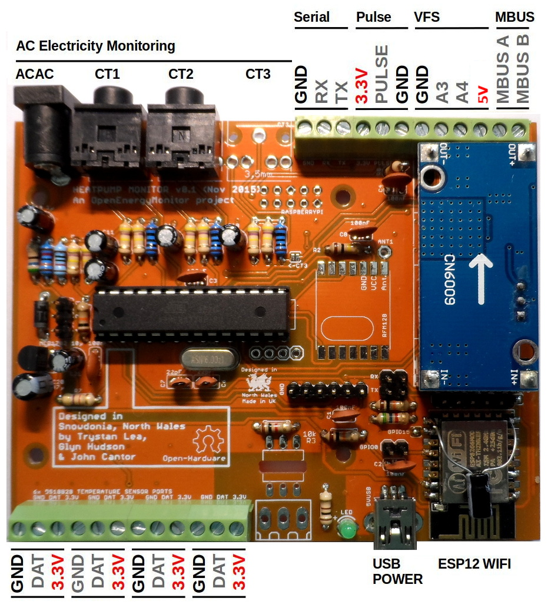
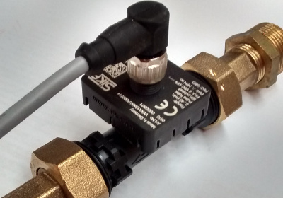

# Installation and setup

First remove the front and rear fascia from the heat pump monitor enclosure so that the terminal connections are accessible. The following image shows the function of each connector:

### Electricity monitoring: IRDA Elster A100C Watt Hour reader

The Heatpump Monitor supports reading from the Irda port on Elster A100C energy meters using the [OpenEnergyMonitor pulse sensor](https://shop.openenergymonitor.com/optical-utility-meter-led-pulse-sensor/). This provides a convenient way of reading the actual watt hours as recorded on the meter avoiding errors that may be caused by a multitude of sources via the other optional methods.

Selection and use of the IRDA reader over pulse counting is done in the Heatpump Monitor firmware here:

[Firmware/Arduino/HeatpumpMonitor_V1/HeatpumpMonitor_V1.ino#L17](https://github.com/openenergymonitor/HeatpumpMonitor/blob/master/Firmware/Arduino/HeatpumpMonitor_V1/HeatpumpMonitor_V1.ino#L17)

Set ELSTER_IRDA_ENABLE to 1:

    #define ELSTER_IRDA_ENABLE 1

**Emoncms configuration**

<table>
<tr><th>Input name</th><th>Input processing and feeds</th></tr>
<tr><td>PulseCount</td><td><b>Log to feed</b> record one standard feed with 'log to feed'. <b>Wh accumulator</b> record a second feed with the wh accumulator process, this process creates a feed where any data gaps are joined producing more reliable kwh graphs.</td></tr>
</table>

### Electricity monitoring: Pulse counting

Many meters have pulse outputs, examples include: single phase and three phase electrical energy meters, Gas meters, Water meters. The pulse output may be a flashing LED or a switching relay (usually solid state) or both.

In the case of an electricity meter, a pulse output corresponds to a defined amount of energy passing through the meter (kWh/Wh). For single-phase domestic electricity meters (e.g. the Elster A100c) each pulse usually equals one Wh (1000 pulses per kWh).  With higher power meters (often three-phase), each pulse corresponds to a greater amount of energy e.g. 2, or even 10, Wh per pulse. 

The connection of the pulse counting sensor is exactly the same as in the Elster Irda meter reader connection above. The same OpenEnergyMonitor pulse sensor used for the Irda can be used for optical pulse counting when attached over the flashing red LED present on most meters. 

Alternatively wired pulse counting is also an option. For wired pulse counting two wires are needed one from the 3.3V supply terminal going to the meter and another switched pulse output coming back to the PULSE input terminal on the heatpump monitor.

When using the pulse counting input with wired pulse output meters such as an Elster A100C or Ampy single phase meter two additional components are needed to provide reliable pulse counting. A pull down resistor is needed across the pulse input (100k) and ground and then a 100nf capacitor is needed to filter any high frequency pulses outside the expected range. The footprint for these are now on the PCB just below the terminals.

For more information on pulse counting see the Building Blocks page: [Introduction to Pulse Counting](https://openenergymonitor.org/emon/buildingblocks/introduction-to-pulse-counting)

The pulse counting input on the heatpump monitor is just a interrupt enabled digital input on the atmega328.

**Emoncms configuration**

<table>
<tr><th>Input name</th><th>Input processing and feeds</th></tr>
<tr><td>PulseCount</td><td><b>Log to feed</b> record one standard feed with 'log to feed'. <b>Wh accumulator</b> record a second feed with the wh accumulator process, this process creates a feed where any data gaps are joined producing more reliable kwh graphs.</td></tr>
</table>

### Electricity monitoring: CT and AC-AC adapter

In addition to the elster irda meter reader and pulse counting options the heatpump monitor also supports standard OpenEnergyMonitor CT and AC-AC Adapter based electricity monitoring. The AC-AC Adapter is required for voltage signal measurement and real power calculation which gives greater measurement accuracy.

CT Burden resistor sizing: The current range measurable by the CT based measurement is dependent on both the CT sensor used and the burden resistor size on the heat pump monitoring board. In order to obtain higher measurement resolution it is recommended to size the burden resistor to match closely the maximum rated electrical power input of the heat pump.

The included burden resistor in the heatpump monitor kit is 100 Ohms, this provides a AC power measurement range of **0 - 5.4 kW**. This provides ample range for many small domestic heatpumps. A smaller burden resistor can be used instead for larger measurement range at lower resolution. See Building Blocks guide [CT sensors - interfacing with arduino](https://openenergymonitor.org/emon/buildingblocks/ct-sensors-interface)

**Calibration and Accuracy**

The CT and AC-AC power measurement circuitry was designed for indicative power measurement, better than many home energy monitors available but less accurate than billing grade class 1 or 2 electricity meters. In order to draw reliable conclusions on heat pump COP performance it is recommended to use the Elster Irda Watt hour reader or pulse counting input in conjunction with a class 1 or 2 electricity meter for accumulated electricity consumption measurement. This can be in parallel with the CT based measurement which has the advantage of providing higher temporal resolution power readings useful when analysing heating runs in detail.

In order to confirm the accuracy of the heat pump monitor electricity measurement note down a manual meter reading from the heat pump kwh meter when the heat pump monitor is first powered up, note down the date and time of this reading. After a measurement period of around 1 week check the accumulated electricity consumption recorded by the heat pump monitor both from the pulse counting input, the CT sensors against the consumption as read manually on the kwh meter.

See [Building Blocks: Sources of error in the emontx voltage and current inputs](https://openenergymonitor.org/emon/buildingblocks/emontx-error-sources)

**Emoncms configuration**

<table>
<tr><th>Input name</th><th>Input processing and feeds</th></tr>
<tr><td>OEMct1</td><td><b>Log to feed</b> record one standard power feed with 'log to feed'. <b>power to kWh</b> record a second feed with the power to kwh process, this process creates a cumulative kWh feed from the power input.</td></tr>
<tr><td>OEMct2</td><td><b>Log to feed</b> record one standard power feed with 'log to feed'. <b>power to kWh</b> record a second feed with the power to kwh process, this process creates a cumulative kWh feed from the power input.</td></tr>
<tr><td>OEMct1Wh</td><td><b>Wh accumulator</b> use the wh accumulator process to record the cumulative watt hour data in a feed where any data gaps are joined producing more reliable kwh graphs.</td></tr>
<tr><td>OEMct2Wh</td><td><b>Wh accumulator</b> use the wh accumulator process to record the cumulative watt hour data in a feed where any data gaps are joined producing more reliable kwh graphs.</td></tr>
</table>

### Heat metering: MBUS Kamstrup heat meter

A core feature of the heatpump monitor board is the MBUS meter reader and integrated firmware for reading heat metering data from Kamstrup Multical 402 heat meters. [https://www.kamstrup.com/en-en/products-solutions/thermal-energy-meters/multical-403](https://www.kamstrup.com/en-en/products-solutions/thermal-energy-meters/multical-403)

Ensure the heat pump monitor is un-powered before connection. Connect using 2-core wire the MBUS reader terminals (top-right) with the MBUS connection of your kamstrup heat meter. The polarity does not matter but care needs to be taken not to short the two wires as this may cause damage to the MBUS interface or card.

Ensure the blue voltage converter board is fitted and positioned with the arrow pointing upwards as shown in the diagram above. The output of the voltage converter should be nearest the MBUS terminal connections.

Once connected the heat pump monitor will auto detect the Kamstrup heat meter address and pass the polled data through without further configuration.

Troubleshooting: If the kamstrup meter data does not appear straight away, wait several minutes for the reader to rescan. The voltage across the MBUS reader terminals should be close to 24V.

**Emoncms configuration**

<table>
<tr><th>Input name</th><th>Input processing and feeds</th></tr>
<tr><td>KSflowT</td><td>Flow temperature (Celcius) <b>Log to feed</b> record to PHPFina feed at 10s interval.</td></tr>
<tr><td>KSreturnT</td><td>Return temperature (Celcius) <b>Log to feed</b> record to PHPFina feed at 10s interval.</td></tr>
<tr><td>KSdeltaT</td><td>Difference beteween flow and return temperature (Kelvin) <b>Log to feed</b> record to PHPFina feed at 10s interval.</td></tr>
<tr><td>KSflowrate</td><td>Water Flowrate (Litres/hour) <b>Log to feed</b> record to PHPFina feed at 10s interval.</td></tr>
<tr><td>KSheat</td><td>Heatpump heat output (Watts) <b>Log to feed</b> record to PHPFina feed at 10s interval. <b>Power to kWh</b> use the power to kwh process to generate a higher resolution kWh feed from the kamstrup power data to be used in parallel with the kWh reading from the kamstrup meter.</td></tr>
<tr><td>KSkWh</td><td>Total cumulative kWh of heat measured by kamstrup (kWh) <b>Log to feed</b> record to PHPFina feed at 10s interval.</td></tr>
</table>

### Heat metering: VFS Flow meter (Sika or Grundfos)

A Vortex Flow Sensor with an analog voltage output such as the Grundfos VFS range or Sika VFS range can be connected to the VFS terminals, top-right next to the MBUS reader terminals. There are two analog inputs on the VFS terminal that map to two 10bit ADC Channels on the Atmega328. For standard configuration use A3 for flowrate measurement and A4 for temperature measurement.

There are a multitude of VFS flow sensors each catering for different flow ranges, the calibration for the VFS sensor is set in the Heatpump monitor firmware here:

[Firmware/Arduino/HeatpumpMonitor_V1/HeatpumpMonitor_V1.ino#L92](https://github.com/openenergymonitor/HeatpumpMonitor/blob/master/Firmware/Arduino/HeatpumpMonitor_V1/HeatpumpMonitor_V1.ino#L92)

    // --------------------------------------------------
    // VFS config
    // --------------------------------------------------
    double VFS_maxflow          = 40.0;  // Litres/minute
    double VFS_maxflow_voltage  = 3.5;   // Volts
    double VFS_zeroflow_voltage = 0.25;  // Volts
    double VFS_maxtemp          = 100;   // Celcius
    double VFS_maxtemp_voltage  = 3.5;   // Volts
    double VFS_zerotemp_voltage = 0.5; // Volts
    
The calibration values to use here can be found the VFS sensor datasheet.

Testing is ongoing to verify the potential accuracy of heat measurement based on the VFS flowrate and DS18B20 based flow and return temperature readings.

**Emoncms configuration**

<table>
<tr><th>Input name</th><th>Input processing and feeds</th></tr>
<tr><td>VFSflowT</td><td>Flow temperature measured by temperature sensor in VFS flow meter. <b>Log to feed</b> record to PHPFina feed at 10s interval</td></tr>
<tr><td>VFSflowrate</td><td>Flow rate in Litres/hour. <b>Log to feed</b> record to PHPFina feed at 10s interval. <b>Log to feed</b> record to PHPFina feed at 10s interval.</td></tr>
<tr><td>VFSheat</td><td>Heat output measured in Watts by VFS <b>Log to feed</b> record power to PHPFina feed at 10s interval. <b>Power to kWh</b> use the power to kwh process to calculate cumulative kWh feed</td></tr>
</table>

### DS18B20 Temperature sensors

**Emoncms configuration**

<table>
<tr><th>Input name</th><th>Input processing and feeds</th></tr>
<tr><td>DSairoutT</td><td>Air out temperature off air-source heatpump (Celcius) <b>Log to feed</b> record to PHPFina feed at 10s interval.</td></tr>
<tr><td>DSairinT</td><td>Air in temperature into air-source heatpump (Celcius) <b>Log to feed</b> record to PHPFina feed at 10s interval.</td></tr>
<tr><td>DSflowT</td><td>Water flow temperature (Celcius) <b>Log to feed</b> record to PHPFina feed at 10s interval.</td></tr>
<tr><td>DSreturnT</td><td>Water return temperature (Celcius) <b>Log to feed</b> record to PHPFina feed at 10s interval.</td></tr>
</table>
