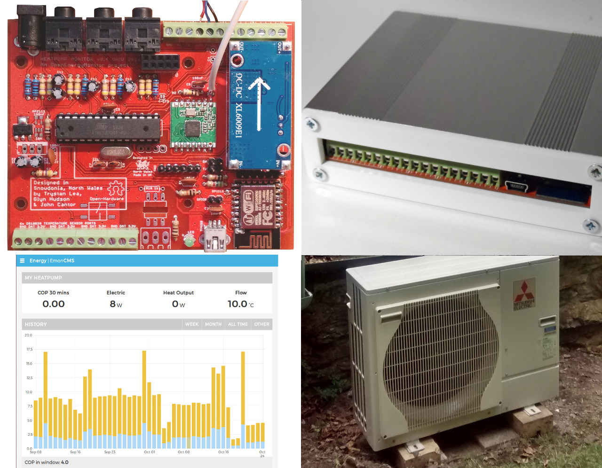

# Heatpump Monitor

This is the technical github repository for the open hardware and software heat-pump performance monitor, part of a wider heat-pump monitoring project by OpenEnergyMonitor.org and John Cantor of heatpumps.co.uk.

This is a web-connected open source hardware heat-pump monitor that can measure heat-pump electrical input, heat output and system temperatures. Alongside open source web software for heat-pump data visualisation, analysis and sharing of open heat-pump data.

## Rationale

Heat-pumps are a key component of zero carbon energy systems making it possible to provide heating efficiently from renewable energy, they are featured in many zero carbon energy scenarios such as ZeroCarbonBritain developed by the Centre for Alternative Technology and are also highlighted in David MacKay's book Sustainable Energy without the hot air.

By monitoring a heat-pump its possible to see how well it is working, diagnose problems and get a better understanding of how a key potentially zero carbon heating solution works, data gathered and shared from well performing systems could help de-mystify heat-pump operation and help improve performance by diagnosing any problems early.

- [Heat pump Monitoring](https://blog.openenergymonitor.org/2015/12/heat-pump-monitoring)
- [Heatpumps in the ZeroCarbonBritain model by the Centre for Alternative Technology.](https://blog.openenergymonitor.org/2015/12/heatpumps-in-zerocarbonbritain-model-by)
- [Heat pump Testing: Initial results](https://blog.openenergymonitor.org/2016/02/heat-pump-testing-initial-results)

## Overview

<table>
<tr><td>

</td><td>
<b>Main Features:</b> 
<ul>
<li>CT current and ACAC voltage based electricity monitoring</li>
<li>Pulse counting or IRDA Elster meter reader</li>
<li>Analog inputs for Vortex Flow Sensor (VFS) option (e.g Sika, Grundfos)</li>
<li>MBUS reader for kamstrup heat meters</li>
<li>4x individually broken out DS18B20 temperature sensor connections</li>
<li>Arduino ATmega328 core</li>
<li>Connectivity options: ESP-12 WIFI, RaspberryPI header, RFM69</li>
</ul>
</td>
</tr>
</table>

## Build Guides

There are two build options for the heatpump monitor board, the first is the full heatpump monitor build with components for the MBUS heat meter reader, DS18B20 temperature sensing plus other interfaces. The second is a cut-down WIFI electricity monitor only build where the additional components for heat metering are not soldered in.

- [Heatpump monitor kit build guide](heatpumpmonitor_build.md)
- [Cut down energy monitor kit build guide](energymonitor_build.md)

**Quick reference**

- [ATmega328 Arduino Firmware: HeatpumpMonitor_V1.ino](https://github.com/openenergymonitor/HeatpumpMonitor/blob/master/Firmware/Arduino/HeatpumpMonitor_V1)
- [ESP8266 EmonESP WIFI Firmware](https://github.com/openenergymonitor/EmonESP)
- [Hardware Schematic and Board files v2](https://github.com/openenergymonitor/HeatpumpMonitor/tree/master/Hardware/v2)

## Installation and setup

The following guide details how to setup the heatpump monitor including interfacting with an Elster A100C Irda port and connecting up to a Kamstrup MBUS heat meter.

- [Installation and setup](installation.md)
- [Software Setup](software_setup.md)

## Development

- [Development discussion and change log](development.md)

## Open Hardware ++

A case study in open hardware development

- Exporting gerbers from EAGLE, getting a PCB made with a PCB manufacturer such as Ragworm
- [Heatpump Monitor and cut down energy monitor kit costing](costingexample.md)

## Heatpump dashboard

**Login and explore:** [https://openenergymonitor.org/dev/energy](https://openenergymonitor.org/dev/energy)

Source code for the heatpump dashboard can be found as part of the front end emoncms energy site:

[http://github.com/emoncms/energy](http://github.com/emoncms/energy)

Emoncms energy uses emoncms as the data backend.

## Licence

This project is open source software and hardware.

The Arduino firmware is available under the GPL v3 Licence. 

The Web Dashboard is available under the GNU Affero General Public License and is based on emoncms.

The hardware design (schematics, board files and gerber) files are licensed under the [Creative Commons Attribution-ShareAlike 3.0 Unported License](http://creativecommons.org/licenses/by-sa/3.0/) and follow the terms of the [OSHW (Open-source hardware) Statement of Principles 1.0.](http://freedomdefined.org/OSHW)
